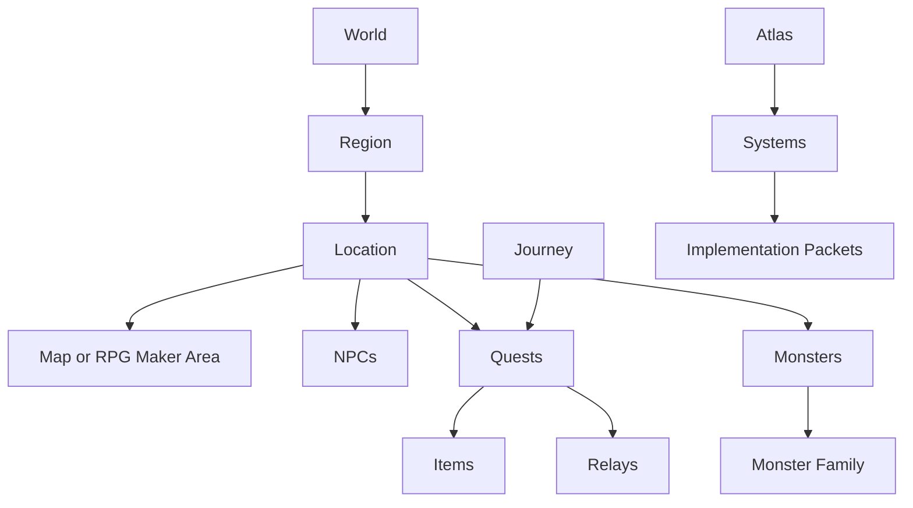

# Atlas Object Model

The Atlas Object Model defines the canonical object types used by Atlas.

This is the foundation of Atlas OS.

Atlas pages are no longer only documents. Many Atlas pages are now **objects**: locations, regions, NPCs, monsters, quests, items, relays, journeys, systems, and implementation packets.

---

## Purpose

This document answers:

> What kinds of things exist in Atlas, and how should they be represented?

---

## Prime Rule

Every reusable game concept that may be referenced by another page should become an Atlas object with a stable ID.

Changing the display name of an object must not change its ID.

---

## Object Classes

| Class | Prefix | Example | Purpose |
|---|---|---|---|
| Region | REG | REG-HOM-001 | Large playable geographic region |
| Location | LOC | LOC-ASH-001 | Town, dungeon, landmark, shrine, or map area |
| NPC | NPC | NPC-ELA-001 | Named non-player character |
| Character | CHR | CHR-KAI-001 | Major party or story character |
| Quest | QST | QST-HOM-001 | Player objective chain |
| Monster | MON | MON-GEL-001 | Enemy or enemy variant |
| Monster Family | FAM | FAM-GEL-001 | Reusable enemy family |
| Item | ITM | ITM-KEY-001 | Item, key item, equipment, relic |
| Relay | REL | REL-007 | Major relay node |
| Journey | JRN | JRN-001 | Major story movement unit |
| System | SYS | SYS-SAVE-001 | Gameplay or technical system |
| Asset | AST | AST-BTR-001 | Art/audio/UI asset requirement |
| Implementation Packet | IMP | IMP-HOM-001 | Codex-ready implementation task |
| Decision Record | DDR | DDR-0001 | Locked design or architecture decision |

---

## Object Hierarchy

---

## Object Types

### Region

A region is a playable geographic area or major world division.

Examples:

- Home Island
- Coalmouth Region
- Athenaeum Region
- Dead Circuit

Regions contain locations, routes, encounter tables, culture notes, and progression rules.

---

### Location

A location is a specific playable or story-relevant place.

Examples:

- Ashford
- Skyreach Hill
- Glassfield Ruins
- Coalmouth Mine
- The Vault

Locations may contain maps, NPCs, shops, quests, secrets, monsters, treasure, events, and implementation notes.

---

### NPC / Character

A character object represents a named person or intelligence.

Use `CHR` for party members, central villains, and major story figures.

Use `NPC` for named supporting characters.

---

### Quest

A quest is a structured player objective chain.

A quest should have triggers, requirements, location references, NPC references, rewards, switches, variables, and completion conditions.

---

### Monster Family

A family defines the shared silhouette, behavior, art direction, and variant logic for related enemies.

Example: Gel Family.

---

### Monster

A monster is a specific enemy variant or boss.

Example: Meadow Gel.

Monsters should reference their family.

---

### Item

An item object may be a consumable, weapon, armor, relic, key item, quest item, or hidden object.

Items should define both fantasy-facing meaning and hidden reality when relevant.

---

### Relay

A relay object represents one of the major old-world relay nodes tied to archive recovery and world progression.

Relays are major story/system objects and should connect to region, location, quest, boss, and archive state.

---

### Journey

A journey object represents a major story phase.

Example: Journey I — The Dreamer.

Journeys own major story beats and reference quests, locations, party changes, reveal stages, and archive milestones.

---

### System

A system object represents a reusable gameplay or technical system.

Examples:

- Save Shrine
- Fast Travel
- Archive Recovery
- Protocol Skills
- Relay Shutdown

---

### Implementation Packet

An implementation packet translates approved Atlas objects into Codex-ready work.

Implementation packets should be small, testable, and traceable.

---

## Object Status Values

| Status | Meaning |
|---|---|
| Draft | Proposed or incomplete |
| Review | Ready for critique |
| Approved | Canonical direction accepted |
| Locked | Stable for implementation |
| Deprecated | Retained for history but no longer active |
| Archived | Moved out of active production |

---

## Required Object Fields

Every object page should include:

- stable object ID,
- object type,
- title/display name,
- status,
- dependencies,
- related object IDs,
- design layer,
- hidden layer when relevant,
- production layer,
- implementation notes,
- revision history.

---

## Authoring Rule

Do not create unnamed objects casually.

If a concept will be referenced repeatedly, assign it an ID and add it to the registry.

---

## Future Expansion

This model may later support automated validation, graph generation, object indexes, and Codex task extraction.

---

## Revision History

| Version | Change |
|---|---|
| 0.1 | Initial Atlas OS object model |
