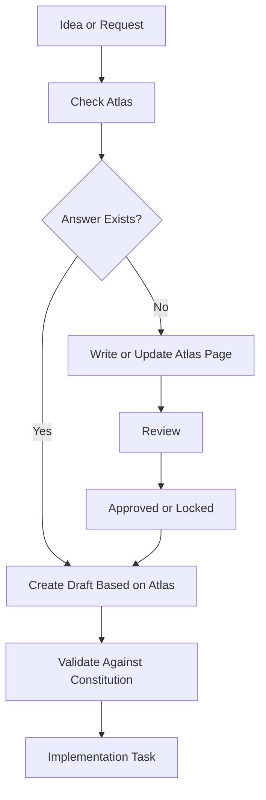

# Atlas Operating System

Atlas Operating System defines how humans and AI agents interact with Atlas.

It is the workflow layer of the project.

---

## Prime Directive

Before implementation, invention, asset creation, dialogue writing, or map design, consult Atlas.

If Atlas does not yet answer the question, update Atlas first.

---

## Standard Creation Workflow

---

## Required Reading Order

Before creating significant content, read in this order:

1. Project Constitution
2. Studio Manifesto
3. Creative Bible
4. Relevant Atlas section
5. Relevant Decision Records
6. Existing implementation notes

---

## AI Role Model

Atlas defines roles, not products.

| Studio Role | Current Tool Example | Responsibility |
|---|---|---|
| Production Director | Chris | Approves direction and owns final project decisions |
| Creative Director | ChatGPT | Protects vision, coherence, world logic, and Atlas quality |
| Technical Director | Codex | Implements approved Atlas content in code/data/RPG Maker |
| Narrative Director | Claude | Expands dialogue, lore, NPCs, memories, books |
| Art Director | Image generation | Produces visual assets from Atlas-approved prompts |

If tools change later, the roles remain.

---

## Validation Questions

Every contribution must pass these questions:

1. Does this match the Project Constitution?
2. Does this increase wonder, curiosity, hope, or coherence?
3. Does this preserve the Dragon Quest-inspired spirit without copying Dragon Quest?
4. Does this obey the hidden technology/cybersecurity layer?
5. Is it feasible for the current implementation target?
6. Can another contributor understand and extend it?
7. Does it make the world feel more inevitable?

---

## Implementation Rule

Implementation is engineering.

Atlas is design.

Do not let implementation invent core lore, world rules, character arcs, or system meanings without updating Atlas first.

---

## Revision History

| Version | Change |
|---|---|
| 0.1 | Initial operating model for Atlas v1.0 architecture phase |
