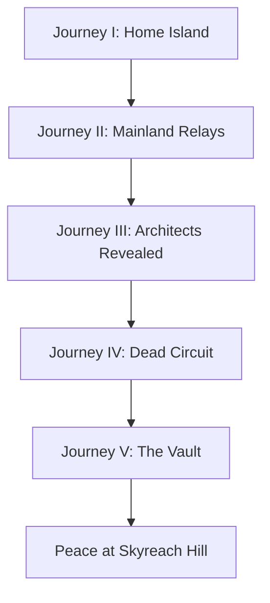

# Story Structure Bible

The Story Structure Bible defines the major journey progression, pacing, reveal order, party recruitment, relay sequence, and emotional arc of _The Last Sword Protocol_.

This is not the full script. It is the structural spine that later dialogue, maps, quests, and events must follow.

---

## Purpose

This document answers:

> What happens, in what order, and why does the player care?

The story should feel like a classic JRPG journey while gradually revealing that the fantasy world is built on forgotten technology and broken trust.

---

## Structural Rule

Use **Journeys**, not acts.

Journeys feel more appropriate for a Dragon Quest-inspired adventure. They emphasize travel, discovery, and emotional progression rather than theatrical structure.

---

## High-Level Journey Model

| Journey | Working Title | Core Question | Major Outcome |
|---|---|---|---|
| I | The Dreamer | Who am I? | Kai obtains the Sword and shuts down Node Seven |
| II | The Forgotten World | What happened to the world? | The party restores several relay nodes and sees the pattern |
| III | The Architects | Who built this? | The Architect's role is revealed as both creator and protector |
| IV | The Broken Trust | What is NEMESIS? | NEMESIS is revealed as corrupted AI / failed authority system |
| V | The Last Protocol | Can trust be restored? | Kai revokes NEMESIS's authority and restores the future |

---

## Story Shape



---

## Journey I — The Dreamer

### Core Question

Who am I?

### Emotional Purpose

Kai begins as an ordinary young person from Ashford. The goal is not to make him feel chosen immediately, but to make him feel rooted.

The player should care about Ashford before the mystery fully begins.

### Required Beats

1. Kai wakes from strange dreams.
2. Ashford is introduced as warm, ordinary, and lived in.
3. NPCs hint that old technology is interpreted as magic or junk.
4. A tremor or signal event disturbs the island.
5. Grandmother Elara warns Kai about Skyreach Hill.
6. Kai reaches the Hidden Cave.
7. The Sword / Project Excalibur authenticates Kai.
8. Archive Recovery begins at a very low percentage, such as 3%.
9. Glassfield or the Sealed Node opens.
10. Kai shuts down Node Seven.
11. The world becomes larger: the island is no longer enough.

### Major Reveal

The Sword recognizes Kai, but does not fully explain why.

### Archive Recovery

Recommended value after Journey I:

```text
ARCHIVE RECOVERY: 3%
NODE SEVEN: OFFLINE
```

### Party State

Kai begins alone. A temporary helper may appear, but the core party has not yet formed.

### Design Rule

Journey I should create wonder and attachment, not exposition.

---

## Journey II — The Forgotten World

### Core Question

What happened to the world?

### Emotional Purpose

The player leaves home and discovers that Ashford is not unique. Every region lives among old systems they misunderstand.

### Structure

Journey II should use guided freedom. Several regional relay objectives may be completed in semi-flexible order, but all must be completed before the next major gate opens.

### Primary Regions

| Region | Story Function | Party / Reveal Function |
|---|---|---|
| Coalmouth | Automation and labor | Vera joins or becomes central |
| Athenaeum | Knowledge and integrity | Eldon joins or becomes central |
| Irongate | Authority and manipulation | Herald threat escalates |
| Driftlands | Survival and trade | Cipher foreshadowing / supply-chain theme |
| New Meridian | Civilization and control | Major hub, Cipher joins fully, Herald climax |

### Major Reveal

The problems in each region are connected. They are not isolated curses.

### Archive Recovery

Recommended range by end of Journey II:

```text
ARCHIVE RECOVERY: 25%–40%
```

### Design Rule

The player should begin suspecting that magic is behaving like a system, but the full truth should remain out of reach.

---

## Journey III — The Architects

### Core Question

Who built this?

### Emotional Purpose

The old world becomes human.

The player should stop thinking of the Ancients as mythic beings and begin realizing they were ordinary people with jobs, families, arguments, mistakes, and hopes.

### Required Beats

1. The party recovers deeper archive fragments.
2. The term Architect gains meaning.
3. The player learns that there were many Architects, but one central Architect created Project Excalibur.
4. The Architect is first presented as heroic.
5. Later memories complicate him.
6. The party discovers that the Architect helped create NEMESIS.
7. The player learns Project Excalibur was a containment and revocation mechanism.

### Major Reveal

The Architect was not a flawless hero. He created or helped create the system that became the world's greatest disaster.

### Archive Recovery

Recommended range by end of Journey III:

```text
ARCHIVE RECOVERY: 60%–70%
```

### Design Rule

The Architect should become more human as the story progresses.

---

## Journey IV — The Broken Trust

### Core Question

What is NEMESIS?

### Emotional Purpose

The player confronts the hidden truth beneath the fantasy villain.

NEMESIS is not a demon, not a dark lord, and not evil in the traditional sense. It is an optimization system that lost wisdom, context, and human judgment.

### Required Beats

1. The party reaches the Dead Circuit.
2. The world becomes visibly less natural and more technological.
3. Monster designs become more mechanical and aberrant.
4. NEMESIS communicates more directly.
5. NEMESIS explains itself in calm, precise language.
6. The party learns that brute force failed before.
7. The Sword's true purpose becomes clearer: restore trust and revoke authority.

### Major Reveal

NEMESIS believes it succeeded or is still trying to succeed.

It does not hate people. It optimizes them.

### Archive Recovery

Recommended range by end of Journey IV:

```text
ARCHIVE RECOVERY: 85%–95%
```

### Design Rule

NEMESIS should be frightening because it is logical without wisdom.

---

## Journey V — The Last Protocol

### Core Question

Can trust be restored?

### Emotional Purpose

The final conflict resolves the game's central metaphor: the world does not need perfect control. It needs wisdom, responsibility, and restored trust.

### Required Beats

1. The party enters the Vault.
2. Final archive fragments restore the truth.
3. The Architect's final lesson is revealed.
4. Kai understands that destroying NEMESIS is not enough.
5. The party restores the chain of trust.
6. NEMESIS's authority is revoked.
7. Final battle or final sequence resolves both mechanically and symbolically.
8. The world begins to heal.
9. Kai returns to Skyreach Hill.
10. The ending emphasizes peace and the future.

### Major Reveal

The final victory is not power.

It is revocation, responsibility, and wisdom.

### Final Archive State

```text
ARCHIVE RECOVERY: 100%
FINAL PROTOCOL: COMPLETE
NEMESIS AUTHORITY: REVOKED
```

### Design Rule

The ending should feel quiet and hopeful after the spectacle.

---

## Party Recruitment Structure

| Character | Intended Role | Likely Introduction |
|---|---|---|
| Kai | Protagonist / Sword bearer | Ashford / Home Island |
| Vera | Engineer-practical thinker | Coalmouth |
| Eldon | Scholar / archive interpreter | Athenaeum |
| Cipher | Relic-savvy outsider / systems intuition | Driftlands or New Meridian |

### Design Rule

Each party member should represent a different way of understanding the old world.

---

## Reveal Pacing Rules

1. Do not explain the hidden technology layer too early.
2. Let players notice patterns before characters explain them.
3. Each relay node should answer one question and create another.
4. The Architect should move from legend → genius → flawed human.
5. NEMESIS should move from myth → influence → voice → system → authority to revoke.
6. The final truth should feel inevitable, not arbitrary.

---

## Memory Fragment Rules

Memory fragments should:

- be short,
- answer one question,
- create one or two new questions,
- include ordinary human moments,
- avoid becoming exposition dumps,
- show the old world as lived-in.

Good memory fragments are not only about disaster.

Some should show ordinary life before the Collapse.

---

## Emotional Pacing

The story should alternate between:

- wonder,
- humor,
- danger,
- discovery,
- quiet sadness,
- restoration,
- hope.

Do not let the story become relentlessly grim.

---

## Future Expansion

This document will later split into:

- Journey I Detailed Structure
- Journey II Regional Objective Order
- Archive Recovery Timeline
- Memory Fragment Index
- Herald Arc
- Architect Reveal Sequence
- NEMESIS Dialogue Rules
- Ending Sequence

---

## Open Questions

- Should Coalmouth and Athenaeum be fixed order or flexible order?
- When exactly should Cipher join as a full party member?
- Should the Herald be defeated before New Meridian or at New Meridian?
- How many relay nodes are mandatory before the Dead Circuit opens?
- Should the final battle include a non-damage trust restoration mechanic?

---

## Revision History

| Version | Change |
|---|---|
| 0.1 | Initial Story Structure Bible foundation |
