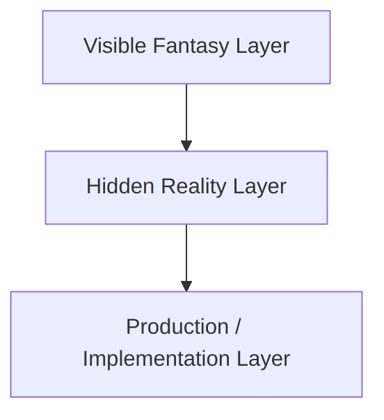

# Atlas Concordance

The Atlas Concordance is the Rosetta Stone of _The Last Sword Protocol_.

It maps the visible fantasy layer to the hidden technological layer and the eventual implementation layer.

Every future Atlas Bible should reference this document.

---

## Purpose

This document prevents drift between story, gameplay, cybersecurity logic, and implementation.

It answers one question:

> When the player sees fantasy, what is actually happening?

---

## The Three-Layer Model

### Visible Fantasy Layer

What the player, villagers, priests, scholars, and legends believe.

Examples:

- magic,
- blessings,
- curses,
- ancient spirits,
- holy shrines,
- sealed doors,
- demons,
- sacred relics.

### Hidden Reality Layer

What Atlas knows is actually true.

Examples:

- authentication,
- authorization,
- corrupted processes,
- recordings,
- archive terminals,
- access controls,
- autonomous systems,
- hardware trust anchors.

### Production / Implementation Layer

How the concept is represented in RPG Maker MZ or another implementation target.

Examples:

- states,
- switches,
- variables,
- common events,
- save events,
- map transfers,
- enemy troops,
- skill effects,
- screen tinting,
- animations.

---

## Core Translation Table

| Fantasy Presentation | Hidden Reality | Production Representation |
|---|---|---|
| The Sword | Project Excalibur; hardware root of trust | Key item, weapon, story switch, ability unlock source |
| Chosen One | Successful identity validation | Bloodline flag, story variable, authentication event |
| Blessing | Authentication or trusted state | State, buff, switch, permission flag |
| Worthiness | Authorization | Conditional branch, access variable, required item |
| Magic Seal | Encryption or access control | Locked event, barrier tile, required protocol skill |
| Ancient Key | Private key, RFID tag, hardware token | Key item, conditional branch |
| Holy Relic | Hardware security module or trusted device | Key item, equipment, quest object |
| Curse | Malware, corruption, compromise | State, debuff, screen tint, enemy effect |
| Possession | Remote access or malicious control | Confusion/charm state, scripted NPC behavior |
| Spirit Voice | Recording, signal, AI fragment, or log playback | Text event, sound effect, memory fragment |
| Shrine | Archive terminal or infrastructure endpoint | Save point, recovery event, archive sync |
| Prayer | User interaction with old system | Show text, choice, save/recover command |
| Resurrection | Medical restoration or backup recovery | Revive event, inn/church function |
| Mana / MP | Energy budget or Sword system reserve | MP resource |
| Spell | Protocol action or system command | Skill database entry |
| Teleport / Warp | Relay routing through authenticated network | Common event, transfer player |
| Monster | Corrupted wildlife, construct, or autonomous system | Enemy database entry, battler asset |
| Boss | Node guardian or major compromised system | Troop encounter, switch on defeat |
| Temple | Infrastructure facility misunderstood as sacred site | Map/dungeon, terminal events |
| Forbidden Knowledge | Encrypted or restricted archive | Book event, memory fragment, permission gate |
| Dark Lord | Mythic interpretation of NEMESIS influence | Villain dialogue, final reveal progression |
| Demon | Aberrant construct or corrupted organism | Enemy family, late-game battler |
| Divine Chain | Chain of trust | Archive progression, relay validation |
| Broken Oath | Revoked or invalid trust | Story reveal, failed access event |

---

## Design Rules

1. The visible fantasy layer must be emotionally sincere.
2. The hidden reality layer must be technically coherent.
3. The production layer must be practical for RPG Maker MZ unless another implementation target is chosen.
4. The player does not need to understand the hidden layer to enjoy the game.
5. A cybersecurity professional should eventually recognize the hidden layer and smile.
6. No supernatural exception may be introduced without a new Design Decision Record.

---

## Example: Shrine

### Visible Fantasy

A shrine is a sacred place where travelers pray, recover, and preserve memory.

### Hidden Reality

A shrine is an archive terminal or maintenance endpoint still running on emergency power.

### Production

RPG Maker MZ implementation may use:

- save command,
- recover all,
- screen glow animation,
- sound effect,
- archive percentage variable,
- memory fragment trigger.

---

## Example: Curse

### Visible Fantasy

A curse is a dark affliction caused by evil magic.

### Hidden Reality

A curse is compromise: malware, corrupted firmware, poisoned signal, or hostile system influence.

### Production

RPG Maker MZ implementation may use:

- poison/confusion/paralysis states,
- stat debuffs,
- screen tint,
- enemy skill,
- timed event behavior,
- NPC dialogue changes.

---

## Example: Sealed Door

### Visible Fantasy

Only the worthy may enter.

### Hidden Reality

The door is an access control system requiring authenticated identity and authorization.

### Production

RPG Maker MZ implementation may use:

- conditional branch checking Sword obtained,
- archive percentage threshold,
- key item,
- switch,
- animation,
- transfer event.

---

## Required Future Expansion

This document must eventually expand into dedicated concordance sections:

- Magic and protocol skills
- Relics and hardware devices
- Shrines and save systems
- Monsters and corruption models
- Relays and network infrastructure
- NPC belief levels
- Story reveal timeline
- RPG Maker implementation patterns

---

## Open Questions

- Should the term "Protocol" appear in player-facing skill names early, late, or never?
- Should villagers use one consistent word for old technology, or should each region have its own mythology?
- Should save shrines be universal, or should different cultures interpret them differently?

---

## Revision History

| Version | Change |
|---|---|
| 0.1 | Initial Concordance foundation |
