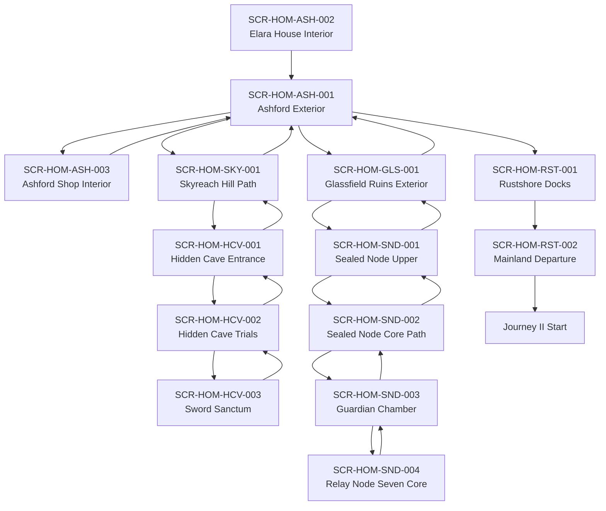

# Home Island Screen Flow

This document defines the playable screen flow for the Home Island vertical slice.

It is the high-level map transfer graph that Codex should use when wiring RPG Maker MZ transfer events.

---

## Purpose

This document answers:

> Can the player move from new game start to mainland departure without missing or ambiguous screen transitions?

---

## Core Flow



---

## Story Gates

| Gate | Required State | Opens |
|---|---|---|
| Skyreach access | J1_Skyreach_AccessOpen | SCR-HOM-SKY-001 |
| Sword Sanctum access | J1_Trial_Body_Clear + J1_Trial_Mind_Clear + J1_Trial_Heart_Clear | SCR-HOM-HCV-003 |
| Glassfield lower entrance | J1_Sword_Obtained | SCR-HOM-SND-001 |
| Relay core access | J1_Node07_GuardianDefeated | SCR-HOM-SND-004 |
| Mainland departure | J1_Mainland_TravelUnlocked | SCR-HOM-RST-002 |

---

## Required Critical Path

The minimum critical path is:

```text
SCR-HOM-ASH-002
→ SCR-HOM-ASH-001
→ SCR-HOM-SKY-001
→ SCR-HOM-HCV-001
→ SCR-HOM-HCV-002
→ SCR-HOM-HCV-003
→ SCR-HOM-GLS-001
→ SCR-HOM-SND-001
→ SCR-HOM-SND-002
→ SCR-HOM-SND-003
→ SCR-HOM-SND-004
→ SCR-HOM-RST-001
→ SCR-HOM-RST-002
→ Journey II Start
```

---

## Optional / Non-Critical Screens

| Screen | Status | Notes |
|---|---|---|
| SCR-HOM-ASH-003 | Optional but recommended | Early shop and prep |
| SCR-HOM-FOG-001 / SCR-HOM-FOG-002 | Optional defined branch | Optional exploration content; must not block critical path |
| Elder House / Inn | Not yet defined | Add only if needed for pacing |

---

## Flow Validation Rules

- Every screen must have at least one valid entry path unless it is a cutscene-only destination.
- Every dungeon screen must have a return path unless deliberately one-way.
- Story gates must have a clear switch condition.
- No critical path gate may depend on an optional screen.
- Every terminal critical-path transition must eventually lead to Journey II start.

---

## Open Questions

- Should Glassfield route go through a shared Home Island overworld screen instead of directly from Ashford?
- Should Rustshore departure be reachable before Glassfield as optional exploration?
- Should Journey II start be Coalmouth directly or a mainland landing screen?

---

## Revision History

| Version | Change |
|---|---|
| 0.1 | Initial Home Island screen flow graph |
