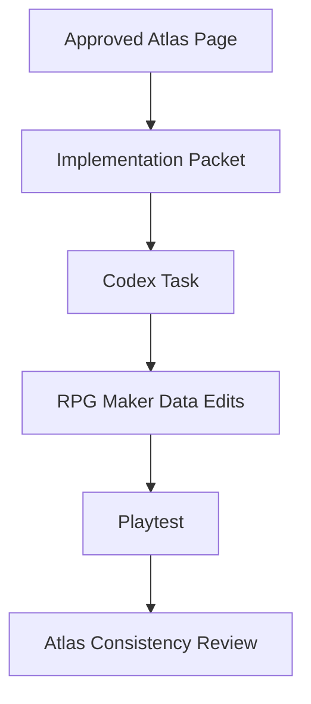

# RPG Maker MZ Bible

The RPG Maker MZ Bible defines how Atlas-approved design becomes a practical RPG Maker MZ implementation.

Atlas remains engine independent. RPG Maker MZ is the first implementation target.

---

## Purpose

This document answers:

> How should Codex and future implementers translate Atlas into RPG Maker MZ maps, database entries, switches, variables, events, and assets?

---

## Prime Rule

Use RPG Maker MZ's native systems first.

If the engine can convincingly fake the experience with events, switches, variables, common events, database entries, pictures, animations, or simple plugins, use the fake.

Avoid building custom systems unless Atlas explicitly requires them.

---

## Implementation Flow



---

## Repository Assumption

Long-term target structure:

```text
/
├── atlas/      # Canonical design authority
├── game/       # RPG Maker MZ implementation target
├── art/        # Source art and generated assets
├── prompts/    # Image/audio/text prompt libraries
├── tools/      # Scripts and utilities
└── archive/    # Retired experiments and prototypes
```

The current RPG Maker prototype may remain in its existing layout until formal implementation migration begins.

---

## Map Standards

Map names should be readable and grouped by region.

Preferred style:

```text
WLD_HomeIsland_Overworld
TWN_Ashford_Exterior
INT_Ashford_KaiHouse
DGN_SkyreachHill_Cave01
DGN_Node07_RelayCore
TWN_Coalmouth_Exterior
DGN_Coalmouth_Mine01
```

### Prefixes

| Prefix | Meaning |
|---|---|
| WLD | World / overworld map |
| TWN | Town or settlement |
| INT | Interior |
| DGN | Dungeon |
| EVT | Event-only or cutscene map |
| TMP | Temporary prototype map |
| ARC | Archived map |

---

## Switch Standards

Switches should describe permanent story or world state.

Preferred examples:

```text
J1_Sword_Obtained
J1_Node07_Offline
J2_Coalmouth_MineCleared
J2_Athenaeum_NodeOffline
SYS_FastTravel_Unlocked
NPC_Elara_PostNode07
```

Avoid vague names such as `Door Open`, `Boss Dead`, or `Switch 42`.

---

## Variable Standards

Variables should describe values that change or are checked repeatedly.

Preferred examples:

```text
Archive_Recovery_Percent
Current_Journey
Current_Relay_Count
Kai_Protocol_Level
World_State_Phase
```

### Archive Recovery

The Archive Recovery percentage should be a central story variable.

Suggested milestones:

| Story Point | Archive Recovery |
|---|---|
| Sword awakening | 3% |
| End of Journey I | 3%–5% |
| Mid Journey II | 15%–25% |
| End Journey II | 25%–40% |
| End Journey III | 60%–70% |
| End Journey IV | 85%–95% |
| Finale | 100% |

---

## Common Event Standards

Common events should handle reusable story/gameplay systems.

Candidates:

```text
CE_SaveShrine_ArchiveSync
CE_RelayNode_Shutdown
CE_Archive_MessageDisplay
CE_FastTravel_Menu
CE_Sword_AccessCheck
CE_MemoryFragment_Play
CE_NEMESIS_Message
```

---

## Database Standards

Use clean ID ranges when possible.

Draft recommendation:

| Database Area | Suggested Range |
|---|---|
| Actors | 1–20 |
| Main party skills | 1–100 |
| Enemy skills | 101–250 |
| Protocol skills | 251–350 |
| Items | 1–200 |
| Key items | 201–300 |
| Weapons | 1–100 |
| Armor | 1–150 |
| Enemies | 1–300 |
| Troops | 1–300 |
| States | 1–100 |

These ranges are draft and should be revised once implementation restarts.

---

## Eventing Rules

1. Keep event pages readable.
2. Name switches and variables before using them.
3. Use comments inside complex events.
4. Prefer common events for repeated logic.
5. Avoid duplicate logic across many maps.
6. Keep cutscenes short and testable.
7. Use self-switches for local state only.
8. Use global switches for story state.

---

## Plugin Philosophy

Plugins are allowed when they clearly serve Atlas.

Use plugins for:

- quality-of-life improvements,
- UI polish,
- battle readability,
- inventory clarity,
- eventing simplification.

Avoid plugins that require:

- major combat rewrites,
- fragile dependency chains,
- undocumented behavior,
- systems Codex cannot maintain.

---

## Asset Naming Standards

Draft format:

```text
CHR_Kai_Walk_v01.png
BTR_Gel_Meadow_v01.png
TIL_Ashford_FactoryVillage_v01.png
PAR_Ashford_SkyreachDistant_v01.png
SFX_ArchiveSync_v01.ogg
BGM_AshfordTheme_v01.ogg
```

---

## Codex Task Packet Standard

Each implementation task should include:

```markdown
# Task

## Atlas References

## Objective

## Files / Data Areas

## Required Switches

## Required Variables

## Events To Create Or Modify

## Acceptance Criteria

## Playtest Steps
```

---

## Future Expansion

This document will later split into:

- Map Standards
- Switch Standards
- Variable Standards
- Common Event Standards
- Database ID Ranges
- Plugin Standards
- Asset Naming Standards
- Codex Task Packet Template
- Playtest Checklist

---

## Open Questions

- Should the RPG Maker project be moved into `/game` now or later?
- Should switch/variable IDs be allocated manually in Atlas before Codex edits data files?
- Should plugin selection be locked before implementation resumes?
- Should prototype maps be archived or converted?

---

## Revision History

| Version | Change |
|---|---|
| 0.1 | Initial RPG Maker MZ Bible foundation |
