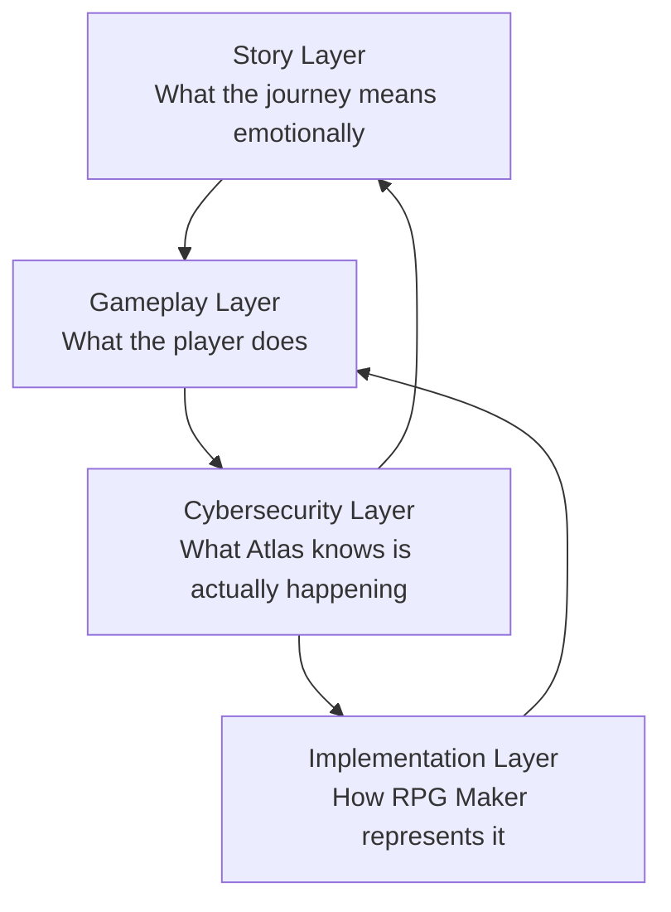

# Truth Layer Diagram

The Truth Layer Diagram explains how the visible story, familiar gameplay, hidden cybersecurity reality, and RPG Maker implementation layer relate to each other.

This document does not add new lore.

It organizes the relationships already established by the Atlas Concordance, Cybersecurity Layer Bible, Gameplay Systems Bible, and Story Structure Bible.

---

## Purpose

The purpose of this document is to keep future Atlas work from drifting between four related but distinct layers:

- what the player experiences as story,
- what the player does through gameplay,
- what Atlas knows is happening in the hidden cybersecurity layer,
- how the project implements those ideas in RPG Maker MZ.

Each layer should support the others without forcing the player to understand all of them at once.

---

## Layer Model



---

## Layer Responsibilities

| Layer | Responsibility | Primary Atlas Sources |
|---|---|---|
| Story Layer | Defines journeys, reveals, emotional stakes, and player-facing meaning | Story Structure Bible |
| Gameplay Layer | Keeps JRPG mechanics readable and familiar | Gameplay Systems Bible |
| Cybersecurity Layer | Defines the hidden technical truth beneath fantasy presentation | Cybersecurity Layer Bible |
| Implementation Layer | Converts Atlas-approved concepts into RPG Maker objects and event logic | Atlas Concordance, RPG Maker MZ Bible, Development Standards |

---

## Core Translation Path

Every major concept should be understandable through this path:

```text
Story meaning -> Gameplay action -> Hidden system truth -> RPG Maker implementation
```

Example:

| Step | Layer | Meaning |
|---|---|---|
| 1 | Story | Kai inherits responsibility when the Sword recognizes him |
| 2 | Gameplay | The player obtains the Sword and unlocks new progress |
| 3 | Cybersecurity | Project Excalibur authenticates a valid successor |
| 4 | Implementation | Key item, weapon, story switch, skill unlock, and conditional branches |

---

## Canonical Concept Map

| Story / Fantasy Presentation | Gameplay Expression | Hidden Cybersecurity Truth | Implementation Pattern |
|---|---|---|---|
| The Sword recognizes Kai | Sword item, weapon, ability source | Project Excalibur authenticates a valid inheritor | Key item, weapon entry, switch, skill unlock |
| Blessing or worthiness | Access to new path, buff, or interaction | Authentication and authorization | State, switch, variable, conditional branch |
| Shrine of Memory | Save, recovery, memory fragment | Archive terminal or infrastructure endpoint | Save event, recover command, archive variable |
| Curse or corruption | Status effect, enemy pressure, screen feedback | Malware, compromise, poisoned signal, or corrupted control logic | State, debuff, enemy skill, tint, event page condition |
| Sealed door or ward | Progression gate | Encryption, access control, or trust validation | Locked event, required item, switch, transfer condition |
| Relay node restored or shut down | Dungeon objective and story milestone | Infrastructure validation, containment, or authority revocation | Boss switch, archive percent variable, route unlock |
| NEMESIS revealed | Villain pressure and final threat | Corrupted optimization system and failed authority | Dialogue events, boss sequence, final protocol state |
| Final Protocol | Endgame resolution | Restored chain of trust and revoked authority | Final switches, variables, battle sequence, ending events |

---

## Story Layer

The story layer controls emotional pacing and reveal order.

The Story Structure Bible defines the journey model:

- Journey I asks who Kai is.
- Journey II asks what happened to the world.
- Journey III asks who built the old systems.
- Journey IV asks what NEMESIS is.
- Journey V asks whether trust can be restored.

The story layer should not explain the hidden truth too early.

Players should first experience a sincere fantasy world, then gradually notice that magic, shrines, curses, relays, and the Sword behave like systems.

---

## Gameplay Layer

The gameplay layer keeps the project playable as a classic JRPG.

The Gameplay Systems Bible establishes that hidden meaning should deepen familiar systems, not make them harder to use.

Important examples:

- HP can remain ordinary health.
- MP can represent Sword-linked protocol energy or a character-specific resource.
- Skills can look like magic while functioning as protocol actions in hidden reality.
- Status effects can stay readable while mapping to corruption, signal effects, injury, or trusted states.
- Save points can work like shrines while also representing archive terminals.

Gameplay must remain legible even for players who never fully decode the cybersecurity layer.

---

## Cybersecurity Layer

The cybersecurity layer defines what Atlas knows is true beneath the fantasy.

The Cybersecurity Layer Bible establishes the governing rule:

```text
There is no supernatural magic.
There is only technology whose meaning has been lost.
```

This layer provides the logic for:

- identity,
- authentication,
- authorization,
- chain of trust,
- archive recovery,
- relay infrastructure,
- corruption,
- incident response,
- Project Excalibur,
- NEMESIS,
- the Final Protocol.

The hidden explanation must remain coherent even when the player-facing story uses mythic language.

---

## Implementation Layer

The implementation layer turns Atlas concepts into RPG Maker MZ data and event behavior.

This layer should be practical and reviewable.

Common implementation objects include:

- switches,
- variables,
- states,
- skills,
- key items,
- weapons,
- common events,
- transfer events,
- event pages,
- troops,
- map names.

Implementation should follow the meaning defined by the story, gameplay, and cybersecurity layers instead of inventing new rules locally.

---

## Reveal Discipline

Truth should move from feeling to pattern to explanation.

| Reveal Phase | Player Understanding | Atlas Understanding |
|---|---|---|
| Fantasy phase | Magic, blessings, curses, shrines, relics | Lost technology interpreted through myth |
| Pattern phase | Magic follows rules | Systems are responding to identity, permission, corruption, and infrastructure state |
| Technology phase | Ancient systems are machines | Old-world infrastructure remains partially functional |
| Security phase | Trust and authority matter | Authentication, authorization, chain of trust, and revocation define progress |
| Final Protocol phase | The world can heal | NEMESIS authority is revoked and trust is restored |

---

## Consistency Rules

1. A visible fantasy concept should have a hidden reality explanation unless Atlas explicitly marks it ordinary.
2. A hidden cybersecurity explanation should not force clumsy technical exposition into early dialogue.
3. Gameplay should stay readable before the player understands the hidden layer.
4. RPG Maker implementation should use simple database and event structures where possible.
5. New content should reference the Atlas Concordance before inventing a new mapping.
6. No true supernatural exception may be introduced without a Design Decision Record.

---

## Cross-Reference Checklist

Before creating a new quest, mechanic, relic, monster, shrine, relay, or major event, verify:

- Story meaning: What does this moment mean emotionally?
- Gameplay action: What does the player do?
- Hidden truth: What system behavior is actually happening?
- Implementation object: Which RPG Maker switch, variable, state, item, event, or map represents it?
- Reveal timing: Should the player understand the hidden truth now, later, or never?

---

## Source Documents

| Document | Role |
|---|---|
| Atlas Roadmap | Identifies the Truth Layer Diagram as a Foundation milestone deliverable |
| Atlas Concordance | Defines the visible, hidden, and production translation model |
| Cybersecurity Layer Bible | Defines the hidden engineering and security reality |
| Gameplay Systems Bible | Defines how JRPG mechanics map to hidden technology |
| Story Structure Bible | Defines journey progression and reveal pacing |

---

## Revision History

| Version | Change |
|---|---|
| 0.1 | Initial Truth Layer Diagram |
