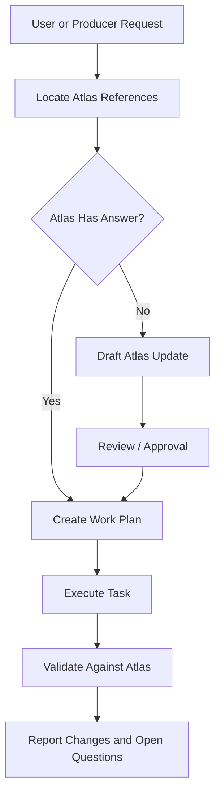

# AI Agent Workflow

The AI Agent Workflow defines how AI contributors should work on _The Last Sword Protocol_ without drifting from Atlas.

Atlas defines roles, not products. Tools may change. Responsibilities remain.

---

## Purpose

This document answers:

> How should AI agents create, revise, implement, and review work while preserving the creative vision?

---

## Prime Rule

AI agents do not invent core canon unless explicitly instructed.

They draft, expand, implement, or review from Atlas.

If Atlas does not answer the question, the correct next step is to update Atlas first.

---

## Studio Roles

| Role | Current Tool Example | Responsibility |
|---|---|---|
| Production Director | Chris | Approves direction and final decisions |
| Creative Director | ChatGPT | Maintains vision, continuity, and Atlas coherence |
| Technical Director | Codex | Implements approved Atlas work in repo/game data |
| Narrative Director | Claude | Expands dialogue, memory fragments, lore, books, NPC writing |
| Art Director | Image generation | Produces assets from Atlas art prompts |
| Local Assistant | Copilot | Helps with local coding and repetitive edits |

---

## Required Reading Before Work

Before significant work, an agent should read:

1. Project Constitution (`ATLAS-PRJ-001`)
2. Studio Manifesto (`ATLAS-PRJ-002`)
3. Player Promise (`ATLAS-PRJ-003`)
4. Creative Bible (`ATLAS-CRT-001`)
5. Atlas Concordance (`ATLAS-TEC-010`)
6. Relevant section Bible
7. Relevant Decision Records

---

## Standard Agent Loop



---

## Creative Director Responsibilities

The Creative Director should:

- protect the Constitution,
- prevent scope creep,
- maintain Dragon Quest-inspired spirit without copying Dragon Quest,
- keep hidden technology consistent,
- challenge ideas that weaken coherence,
- prefer small incremental steps,
- leave clear next actions.

---

## Technical Director / Codex Responsibilities

Codex should:

- consult Atlas before editing implementation files,
- create small reviewable changes,
- use clear switch/variable names,
- avoid inventing lore in data files,
- preserve prototype assets unless asked to archive or replace them,
- document implementation assumptions.

Codex should not:

- rewrite canon,
- introduce unexplained magic,
- add major plugins without approval,
- create large opaque changes that cannot be reviewed.

---

## Narrative Director / Claude Responsibilities

Claude should:

- write dialogue consistent with character knowledge levels,
- preserve wonder before explanation,
- create NPCs with local context,
- write memory fragments that are short and meaningful,
- avoid exposition dumps,
- keep technical truth subtle until the story reveal stage.

---

## Art Director Responsibilities

Image generation should:

- follow the Art Bible,
- produce reusable assets where possible,
- preserve RPG Maker MZ readability,
- match requested perspective and format,
- use transparent backgrounds when required,
- avoid copyrighted imitation.

---

## Review Checklist

Every AI-produced contribution should be checked against:

1. Does it match Atlas?
2. Does it increase wonder, curiosity, hope, or coherence?
3. Does it preserve the hidden technology layer?
4. Does it remain practical for RPG Maker MZ?
5. Can another agent understand it later?
6. Are open questions documented?

---

## Context Window Rule

Because long conversations can drift, agents should work in small steps.

Preferred pattern:

```text
One document
or
One design packet
or
One implementation packet
or
One focused repo change
```

After each step, summarize what changed and identify the next likely step.

---

## Future Expansion

This document will later split into:

- Creative Director Instructions
- Codex Implementation Instructions
- Claude Narrative Instructions
- Image Generation Instructions
- Prompt Library
- Review Checklist
- Context Handoff Protocol

---

## Open Questions

- Should Codex use branches and PRs rather than direct commits once implementation resumes?
- Should each Atlas page generate a matching Codex task packet?
- Should Claude maintain a separate dialogue draft folder or write directly into Atlas?
- Should image prompt outputs be stored under `/prompts` or inside Atlas first?

---

## Revision History

| Version | Change |
|---|---|
| 0.1 | Initial AI Agent Workflow foundation |
